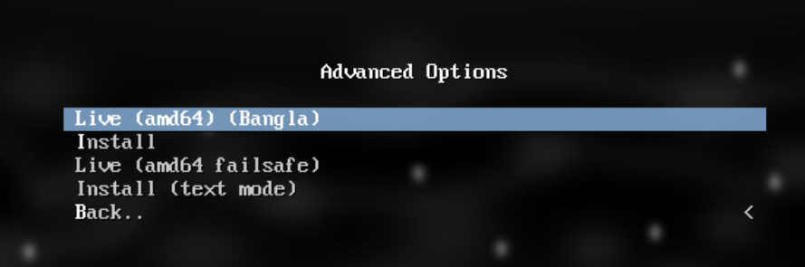

## Table of Contents

- [Booting Up](#booting-up)
  - [Boot Order](#boot-order)
  - [Boot Options](#boot-options)
    - [Advanced Options](#advanced-options)
    - [Entering password](#entering-password)
- [Calamares: GUI Installer](#calamares-gui-installer)
  - [Step 1: Welcome](#step-1-welcome)
  - [Step 2: Locale](#step-2-locale)
  - [Step 3: Keyboard Mapping](#step-3-keyboard-mapping)
  - [Step 4: Partitioning](#step-4-partitioning)
    - [What Is Partitioning?](#what-is-partitioning)
    - [Option #1: Install Along Side](#option-1-install-along-side)
    - [Option #2: Replace A Partition](#option-2-replace-a-partition)
    - [Option #3: Wipe Out Entire Disk](#option-3-wipe-out-entire-disk)
    - [Option #4: Manual Partition](#option-4-manual-partition)
  - [Step 5: Setting Up User Password](#step-5-setting-up-user-password)
  - [Step 6: Confirmation](#step-6-confirmation)
  - [Step 7: The Moment Of Truth](#step-7-the-moment-of-truth)
  - [Step 8: Finish](#step-8-finish)
- [Things After Installation](#things-after-installation)
  - [1. Grub](#1-grub)
  - [2. Date & Time](#2-date-time)
  - [3. Onboarder (`once`)](#3-onboarder-once)

# Booting Up


### Boot Order

After inserting your bootable medium, you need to tell your computer to boot from it.

1. Restart your computer
2. Immediately press the boot menu key repeatedly:
   - Common keys: **F10**, **F12**, **F1**, **Del**, **Esc**, or **F2**
   - The exact key depends on your motherboard manufacturer
   - Watch the screen for a message like "Press F12 for Boot Menu"

3. From the boot menu, select your USB drive (look for "UEFI:" followed by your USB name)

4. If the boot menu doesn't appear, enter BIOS/UEFI settings:
   - Press the setup key (usually **Del**, **F2**, or **F10**) during startup
   - Navigate to the **Boot** tab
   - Move your USB drive to the first position (Boot #1)
   - Press **F10** to save and exit

> [!WARNING]
> **Do not change other settings in BIOS/UEFI unless you are familiar with them.** Changing the wrong setting can prevent your computer from booting properly.

The error.os ISO supports hybrid booting, which works with both BIOS and UEFI systems.

## Boot Options

For BIOS, we use the classic isolinux bootloader.


For modern UEFI systems, we use the GRUB bootloader.


(It may look different inside a VM, that's expected.)

We've tried to keep the isolinux and GRUB menus visually similar, so here are the options available:

<br>

**`Live (amd64) (English)`**: Boots into the live ISO for a preview and lets you install error.os afterward if you like it. "amd64" refers to a 64-bit CPU architecture. This is the recommended, default option. Everything else below is riskier for newcomers.

<br>

> If you get stuck in any of the options below, press your chassis's restart button.

<br>

**`HDT`**: Detects your hardware and shows information about it, useful before installing any OS.

<br>

**`Memory Diagnostic Tool (memtest86+)`**: Tests your RAM for errors, as the name suggests.

### Advanced Options


**`Live (amd64) (Bangla)`**: Same as the English live option, but with the locale set to `bn_BD`. This may have rough edges.

**`Install`**: Installs using Debian's own installer. Not recommended, it just installs the live ISO as-is. We include it only for convenience; avoid it unless you know what you're doing.

**`Install (text mode)`**: Same as **`Install`**, but using Debian's text-based installer.

**`Live (amd64 failsafe)`**: Boots without GPU acceleration and defaults to the English locale. Useful if the normal live mode fails to start.

> The installation guide below works with the GUI-based options, e.g. **`Live (amd64 failsafe)`**, **`Live (amd64) (Bangla)`**, **`Live (amd64) (English)`**.

### Entering password:

By default, autologin is enabled for SDDM, since the previous version had login issues. If you need to access a TTY, or if SDDM asks for a password anyway, use these credentials:

username: `error.user`
password: `user`


<br><br>

The root user's username is `root` and password is `toor`. You can reach a TTY using this key combination:

`Ctrl + Alt + F2` through `Ctrl + Alt + F6` (TTY2 through TTY6). This works the same way in the live ISO.


# Calamares: GUI Installer


Calamares is an open-source installer project maintained mostly by KDE developers. It's the default installer for several distros, including Debian, Zorin OS, and KDE Neon. While alternatives exist, none are as widely adopted as Calamares. What you're seeing here is our own [calamares-settings-error](https://zynomon.github.io/error/dists/stable/main/binary-all/e.html) package, you can inspect the package at that link. It's roughly 80% based on the original calamares-settings-debian.

<hr />

## Step 1: Welcome

Click Next. (The UI has some rough edges, suggestions for improving it are welcome.)


<hr />

## Step 2: Locale


If you don't want quirks like numerals changing to match your selected language, leave this untouched to keep your system and UI entirely in English. To make the system clock auto-update after installation, run this in a terminal:

```bash
sudo apt install systemd-timesyncd
```

> [!TIP]
> Don't confuse this with your physical location. This step is really about locale (language and regional formatting), not a VPN or GPS setting.

<hr />

## Step 3: Keyboard Mapping


Keyboards vary by region and manufacturer, so this step defaults to the most common QWERTY layout. Change it if yours is different.

> [!TIP]
> Search for your keyboard model to find out which layout it uses. This may not work for lesser-known or generic keyboard brands.

<hr />

## Step 4: Partitioning


This is the step where new Linux users most often make mistakes, so pay close attention.

### What Is Partitioning?

<details><summary>It's simply dividing the storage you have (HDD / SATA SSD / NVMe SSD, etc.) into sections so the OS can be installed and boot from one of them.</summary>

<br>

Linux uses the Unix file hierarchy (also used by Android, macOS, BSD, and more):

```text
                                                       /
                                                       |
   -------------------------------------------------------------------------------------------------
   |    |     |    |    |     |    |      |     |    |    |      |    |    |     |    |    |    |    |
  bin  boot  dev  etc  home  lib  lib64 media  mnt  opt  proc  root  run  sbin  srv  sys  tmp  usr  var
```

That's why file paths are written starting with `/`, e.g. `/usr`, `/run`, `/sbin`, `/bin`, `/sys`.

#### What do these directories mean?

<b>/usr</b> - User system resources. Contains programs, libraries, documentation.<br>
<b>/usr/lib &rarr; /lib &amp; /usr/lib64 &rarr; /lib64</b> - Shared libraries and kernel modules.<br>
<b>/usr/bin &rarr; /bin &amp; /usr/sbin &rarr; /sbin</b> - Essential and system administration binaries.<br>
<b>/home</b> - User home directories. Personal files and settings for each user.<br>
<b>/etc</b> - System-wide configuration files. Contains settings for OS, services, and applications.<br>
<b>/proc &amp; /var &amp; /srv</b><br>
&nbsp;&nbsp;/proc - Virtual filesystem. Runtime process and kernel information (CPU, memory, processes).<br>
&nbsp;&nbsp;/var - Variable data. Logs, caches, spools, mail, databases that change frequently.<br>
&nbsp;&nbsp;/srv - Service data. Data for system services like web servers (/srv/www/) or FTP.<br>
<b>/boot</b> - Boot loader files. Contains the Linux kernel (vmlinuz), initrd.img, and GRUB bootloader configuration.<br>
<b>/dev</b> - Device files. Represents hardware devices (hard drives, USB, terminals, null, random).<br>
<b>/media &amp; /mnt &amp; /opt</b><br>
&nbsp;&nbsp;/media - Mount point for removable media (USB drives, CDs, DVDs). Auto-mounts here.<br>
&nbsp;&nbsp;/mnt - Temporary mount point for manually mounted filesystems.<br>
&nbsp;&nbsp;/opt - Optional third-party software packages (add-on applications).<br>

For more information, see <a href="https://zynomon.github.io/error.doc/docs/011/">011</a>, check it out once you're done here.

This section installs the OS into your storage and erases the space you selected for installation.

</details>

Normally, this step shows four options if your system meets the requirements. If there's a problem with automatic partition detection, only Manual Partition will show. Always double-check your setup, you can restart, or create a new partition from unallocated space using the KDE Partition Manager.

### Option: #1 [Install Along Side]


Installs error.os into a partition with more than 5GB of free space, creating a new partition alongside your existing ones without touching them. Best when you have plenty of free space on another OS's partition, or for dual-booting.<br>

### Option: #2 [Replace A Partition]


Replaces the selected partition with error.os. Best for dual-booting.<br><br>

### Option: #3 [Wipe Out Entire Disk]


Wipes the entire selected disk and installs error.os alone. Best if you plan to use error.os as your daily driver.<br><br>

### Option: #4 [Manual Partition]

Now for manual partitioning.


Here's a rough guide:

- `/boot`: 500MB
- swap: match your RAM size (in GB)
- root (`/`): use Btrfs if you want built-in snapshots/backups, or ext4 to keep things simple

You can customize further, but only if you know why you need to.<br><br>

<hr />

## Step 5: [Setting Up User Password]


This step is fairly self-explanatory, but here's what each field does. Your **username** is what you'll see in the terminal. Your **display name** only shows up on the SDDM login screen, lock screen, and the Kicker (application) menu. The **hostname** appears as `[username@hostname]` in some terminal prompts.

**first field** -> Display name ( keep it long and accurate, doesn't matter much )
**second field** -> username ( keep it short )
**third field** -> hostname ( keep it short and memorable )
**fourth field** -> password ( you'll type it frequently, so keep it memorable to you )
**tick ( autologin )** -> SDDM autologin ( logs in automatically on startup instead of asking for a password, good for single-user devices, not for security-conscious setups )

<br>

## Step 6: [Confirmation]


Review your choices for mistakes, then click Next if everything looks correct.

> [!WARNING]
> This action deletes the existing data on the device you are installing to.

## Step 7: [The Moment Of Truth]


The actual installation now begins. It usually takes 3-8 minutes, but can take up to 30 depending on your hardware. If it freezes (more common in VMs) try increasing the VM's allocated RAM and restart the installation.

## Step 8: [Finish]

The system restarts automatically once installation finishes.

# Things After Installation


Everything should work well after installation. You'll see an onboarding prompt, once you're through it, you're in error.os.

There are a few known issues on the installed system:

### 1. Grub


Run this in a terminal to update the bootloader (this will be automated in a future patch):

```bash
sudo update-grub
```


<br><br>


This is the real error.os grub theme.

### 2. Date & Time

If you run into time-sync issues, install and configure `ntp`. It fetches accurate time data over the internet based on your location.

### 3. Onboarder (`once`)

The onboarding app is called `once`, it walks you through installing recommended apps. Currently there's a typo (`firefox` instead of `firefox-esr`) that causes a package-not-found error, so the preselected app bundle won't install. This will be fixed in the next update.

<hr>

#### Next steps,
<div style="text-align:center; font-size:3rem;">
002 -> <a href="./../003">003</a>
</div>

## Related pages

- [004 - Our default apps](./../004)

- [005 - Customizing](./../005)

- [011 - Advanced easy guide to linux](./../011)
