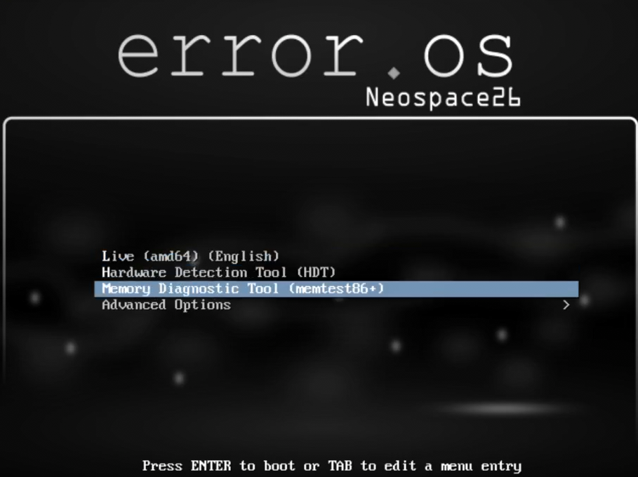
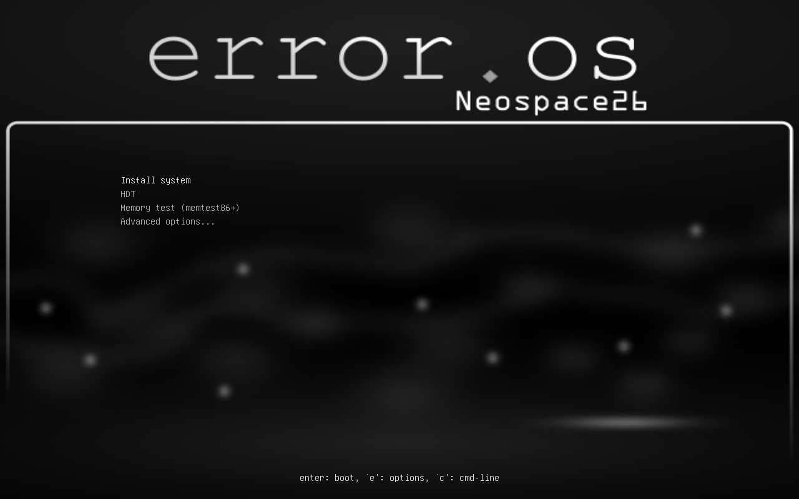

<div class="admonition admonition-warning">
  <p class="admonition-title">Warning</p>
  <p>WARNING.</p>
</div>

<div class="admonition admonition-tip">
  <p class="admonition-title">Tip</p>
  <p>TIP.</p>
</div>

# Booting Up


### Boot Order

After inserting your bootable medium, you need to tell your computer to boot from it.

1. Restart your computer
2. Immediately press the boot menu key repeatedly:
   - Common keys: **F10**, **F12**, **F1**, **Del**, **Esc**, or **F2**
   - The exact key depends on your motherboard manufacturer
   - Watch the screen for a message like "Press F12 for Boot Menu"

3. From the boot menu, select your USB drive (look for "UEFI:" followed by your USB name)

4. If the boot menu doesn't appear, enter BIOS/UEFI settings:
   - Press the setup key (usually **Del**, **F2**, or **F10**) during startup
   - Navigate to the **Boot** tab
   - Move your USB drive to the first position (Boot #1)
   - Press **F10** to save and exit

> [!WARNING]
> **DO NOT change other settings in BIOS/UEFI unless you are familiar with them.** Changing incorrect settings can prevent your computer from booting properly.

The error.os ISO supports hybrid booting, which works with both BIOS and UEFI systems.


## Boot Options
For BIOS we used the good old isolinux


and as for the modern UEFI we used grub bootloader.


( it looks wierd in Virtualization, so dont get it wrong )

we tried our best to keep ISO Linux menu and grub menu similar.
so here are the options we added here

<br>
__`Live (amd64) (English)`__ : it means it will boot into ISO for Preview and let you install it in friendly  and easy manner. that amd64 means cpu with 64 bit arch.  also recommended to click on thats why we put it on first everything except this is kind-of risky for newcomer. 

<br>
> IF YOU GET STUCK TRY TO PRESS THE RESTART KEY OF YOUR CHASSIS in these options below.
<br>
__`HDT`__: it's for detecting hardware and showing information about it, useful before booting up any OS for installation.
<br>

__`Memory Diagnostic Tool (memtest86+)`__: it's explainable through its name it shows informations about Random access memory 
<br>

### Advanced Options
](items/advanced-BIOS.png)

__`Live (amd64) (Bangla)`__ : Is the same thing as the english but with locale set to bn_BD, may break or may not.

__`Install`__ : installs it with debian's own installer its not recommended to use, as it just installs the Live ISO itself. DONT USE IT we put it for convinience.

__`Install (text mode)`__ : Is the same as __`Install`__  but in debian's text installer.

__`Live (amd64 failsafe)`__ : in this mode the system avoids GPU and boots up with the english locale.


> The installation guide below works with the GUI Based options eg. __`Live (amd64 failsafe)`__ , __`Live (amd64) (Bangla)`__  , __`Live (amd64) (English)`__ .


### Entering password:
By default we added autologin to the sddm since in the last version it had issues,
but if you want to access tty or by some chance sddm comes up again use these credential,
username is error.user
and password  is user

<br><br>

And as for root user is root and password is toor alternatively you get those in the live tty through  using these key combination:
`crtl + alt + f2`   - tty2 ***to***  `crtl + alt + f6`  - tty6
it appears like that in Live ISO.


# Calamares: GUI Installer


Calamares Is an Open Source Project Which Is mostly maintained by KDE developers, It's mostly available as the default installer in Debian, Zorin-os , KDE Neon. While there are other  alternatives they aren't as universal as Calamares. What you are seeing is called [calamares-settings-error](https://zynomon.github.io/error/dists/stable/main/binary-all/e.html) (you could see the package there and inspect it, it's mostly 80% of original calamres-settings-debian) 

<hr />

## Step 1: Welcome
Press next ( sorry for the broken ui , We need some suggestions for making some improvements )


<hr />

## Step 2: Locale

If you dont want some broken linguistic stuffs like numerals changing to the language you set etc. 
dont touch it if you want your system and ui stuffs to be English and nothing else, and if you want to make the time auto-update after installation type this in the terminal 
<br>

```bash
sudo apt install systemd-timesyncd
```
<br>

> [!TIP]
> Don't get Confused. Location or locale aren't the same thing but this step metaphorically uses Location as an alias to locale, this won't be setting you up a new VPN to another country. 

<hr />

## Step 3: Keyboard Mapping

Not all keyboards are not the same but this always selects the most commonly used QWERTY layout, so configuring any of it is pointless.

> [!TIP]
> Try to search your keyboard name and know about what layout it has ( may not work with some chinese unknown brand BTW )

<hr />

## Step 4: Partitioning 


This is the step where novice linux users make mistakes, So Keep the focus on

### What Partitioning Is?


<details><summary>It's just piecing of the amount of storage ( HDD / Sata SSD / NVME SSD etc. ) you have for the OS to boot</summary>

   
   
   
   <br>
   Linux uses the Unix file hierchy ( used by Android, MacOS, BSD and more.. )\


<code><pre>
‎                                                     /    
‎                                                     |
    ---------------------------------------------------------------------------------------------------
    |    |     |    |    |     |    |      |     |    |    |      |    |    |     |    |    |    |    |
   bin  boot  dev  etc  home  lib  lib64 media  mnt  opt  proc  root  run  sbin  srv  sys  tmp  usr  var
</code></pre>

   Thats why File expressions are expressed starting with "/"  /usr /run /sbin /bin /sys etc.<br>
<h4>What these directory means?</h4>
  <b>/usr</b> - User system resources. Contains programs, libraries, documentation.<br>
<b>/usr/lib → /lib &amp; /usr/lib64 → /lib64</b> - Shared libraries and kernel modules.<br>
<b>/usr/bin → /bin &amp; /usr/sbin → /sbin</b> - Essential and system administration binaries.<br>
<b>/home</b> - User home directories. Personal files and settings for each user.<br>
<b>/etc</b> - System-wide configuration files. Contains settings for OS, services, and applications.<br>
<b>/proc &amp; /var &amp; /srv</b><br>
&nbsp;&nbsp;/proc - Virtual filesystem. Runtime process and kernel information (CPU, memory, processes).<br>
&nbsp;&nbsp;/var - Variable data. Logs, caches, spools, mail, databases that change frequently.<br>
&nbsp;&nbsp;/srv - Service data. Data for system services like web servers (/srv/www/) or FTP.<br>
<b>/boot</b> - Boot loader files. Contains Linux kernel (vmlinuz), initrd.img, and GRUB bootloader configuration.<br>
<b>/dev</b> - Device files. Represents hardware devices (hard drives, USB, terminals, null, random).<br>
<b>/media &amp; /mnt &amp; /opt</b><br>
&nbsp;&nbsp;/media - Mount point for removable media (USB drives, CDs, DVDs). Auto-mounts here.<br>
&nbsp;&nbsp;/mnt - Temporary mount point for manually mounted filesystems.<br>
&nbsp;&nbsp;/opt - Optional third-party software packages (add-on applications).<br>

More information about them is <a href=https://zynomon.github.io/error.doc/docs/011/>here</a> you could check it out once you are done. <br>
So it installs the OS into your storage and wipes out the corrent space you selected.<br>
</details>


It Basicallly shows 4 options when you met the certain requirements or it would show 1 ( manual installation ) option when there is problem with the automation, always double check ( restart/create a new partition from unallocated one from kde system partition manager )

### Option: #1 [Install Along Side]

This installs the OS into a partition that has more than 5gb storage free so, it partitions the given space to tailor out a new partition while keeping the rest of occupied spaces untouched. ( best when you have plenty of spaces on another OS's partition and for dualbooting )<br>

### Option: #2 [Replace A Partition]

It replaces and installs the OS into the given partition without any hassle ( best for dualbooting )<br><br>


## Option: #3 [Wipe Out Entire Disk]

It just wipes out your entire given disk for error.os ( best for using error.os on a daily basis, is it recommended ? no one ever did it before so unsure of what the answer would be. )<br><br><br>

### Option: #4 [Manual Partition]
Oh! boy we are here at the manual thingy already, 

here is what you should estimate
for /boot you need 500mb of partition
for swap try to choose the amount of gb as your ram has
and as for the storage if you are into backing up stuffs select btrfs and if you are into keep it simple ext4 is the thing for "/" 
and if you want to customize more you could do so. but in the end the headache needs to have it's worth.<br><br><br>

<hr />

## Step 5: [Setting Up User Password]


This is self explanatory, but still here is the explanation, you would be using or seeing your "username" on terminal and stuff and your display name would be only shown on sddm ( login prompt ) screen lock prompt and kicker menu ( application menu ) and the third field sets a hostname it shows as  [username@hostname] on some terminal configuration, 
so, <br>


**first field** -> Display name    ( keep it long and Accurate doesnt much matters )
**second field** -> username    ( keep it short )
**third field** -> hostname  ( keep it short and aliased )
**fourth field** -> password (you would need to frequently type it so keep it on your head)
**tick ( autologin )** -> sddm autologin ( it autologs in on startup instead of asking for password, good for 1 user devices but not for security enthusiasts)

<br>

## Step 6: [Conformation]

This is the step where you confirm if you did any mistakes if you are okay then click on "NEXT"
> [!WARNING]
> THIS ACTION DELETES THE EXISTING ACTUAL DATA ON YOUR DEVICE, THE DEVICE WHERE YOU ARE INSTALLING IT.

## Step 7: The Moment Of Truth


Now The Real installation starts, it takes 3 to 8 mins could take upto 30 min depending on your device, and if it got stuck while installing ( may happen in VM ) try to increase the amount of ram and redo the process  when it freezes like your cursor doesnt moves. 

## Step 8: Finish
After finishing this would restart. 


# Things After installation

after installation everything will work good.
you would get an onboarding prompt after going through it you would be experiencing error.os
There are also few issues and Defects on the installed system
### 1. Grub

to fix this just type

```bash
sudo update-grub
```


in your terminal to update the bootloader ( we will add that in next patch ) <br><br><br>

This is the real error.os grub theme.

### 2. Date & Time
if you get any issue try to install ntp and configuring it. 
ntp uses internet to fetch time data from your location which would be accurate,

### 3. Onboarder ( `once` )
The onboarder is called 'once' it shows guide for installing applications there was a mistake when typed firefox instead of firefox-esr which lead to package not found error, Dont worry, will be fixed in the next update

<hr>
